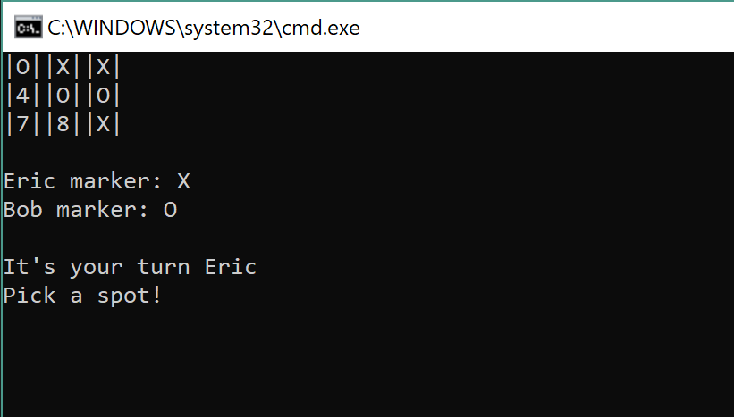

# Lab 04 Tic-Tac-Toe

This is Tic-Tac-Toe built in C# using the Visual Studio IDE. This application allows for two users to play
a game of Tic-Tac-Toe on the same application.
*** 

Upon starting the application, the user will be asked if they'd like to start a game.

Afterwords, each user will be prompted with inputting their desired screen name. First player will be marker
X and second player marker O. A board will then appear and the game has begun.

Starting with player one, the user can select 1-9 and it will replace the selection with the appropriate
marker. After a win condition has been met and winner announced or all 9 turns have been exhausted, the
application will proceed to ask if the users would like to play again. If the user inputs no or anything but
yes, the application will terminate.

Unit tests are including with the project and check for player turns, win conditions, available positions
and correct name of the winner.
***
## Getting Started
* Download the Lab04 Tic-Tac-Toe Project
* After it's been downloaded, navigate to the .csproject file and open up Visual Studio. It is 
  built using the latest .NET 2.1 SDK
* Once the project is opened, run it with or without debug and a console should appear. 
  If the below image is what you are greeted with then success! Create two players and begin a game!

### What it should look like
* This is the starting menu of the application

* This is the player creation input

* This is a sample of game play

***
